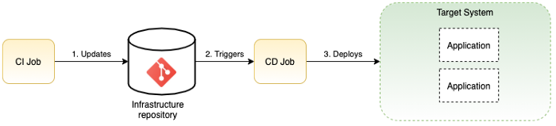

An idempotent operation is one that can be applied multiple times without changing the result beyond the initial application. As such, only actual modification will have an effect on the running system. In continuous deployments, it means that deploying the same app version multiple times will not restart the app every time.

=> CD process requires a target idempotent platform.

## The Push and Pull model

There are two ways to implement a CD process, depending on who is requesting the deployment: PUSH vs. PULL

The first and simpler approach is based on a push model where the deployment request is generated by Git. In this model, when your infrastructure repository is being modified, this triggers a job that will look at the changes and deploy or remove them.

This process is similar to a CI Job. The deployment job gets triggered only when a change to the repository is made.

This approach will work most of the time, but it presents two flaws:

  -  the deployment is executed only when the Git repository is modified. If for any reason, the target system deviates from the Git repository, this is not going to be changed until the next commit on Git.
  -  this model basically mimics a CI process and is typically used when an external tool performs the deployment. In this case, you’ll need to provide your CD tool with all credentials needed to deploy the application on the target system. This can create a security flaw.

A more modern, and DevOps compatible approach, is to use a pull model or an operator mode. This architecture gives the responsibility to the CD tool to monitor both Git but also the target system and reconcile both environments when divergence occurs.

The main difference from the push model is that now the CD tool will monitor both the drifts between the desired state (Git repository) and the actual state (the target system) and ensure that the actual state remains aligned with the desired state.

This avoids having a system deviating from the desired state in uncontrolled ways. As an example, if an operator is making a change directly on the infrastructure by mistake, this would be caught by the CD Tool and reverted back to the desired state described in a Git repo.

This is fundamentally what makes a dedicated CD tool different from a classic CI Tool like Jenkins which is mainly implementing a push model.

We recommend the pull model to get the full benefits of GitOps:

  -  when programmable execution platforms are used (like Kubernetes or Openshift…)
  -  when you opt for recent tools like ArgoCD, Spinnaker, and FluxCD.

ref: https://medium.com/@franoisdagostini/gitops-build-infrastructure-resilient-applications-95bbc939046d
